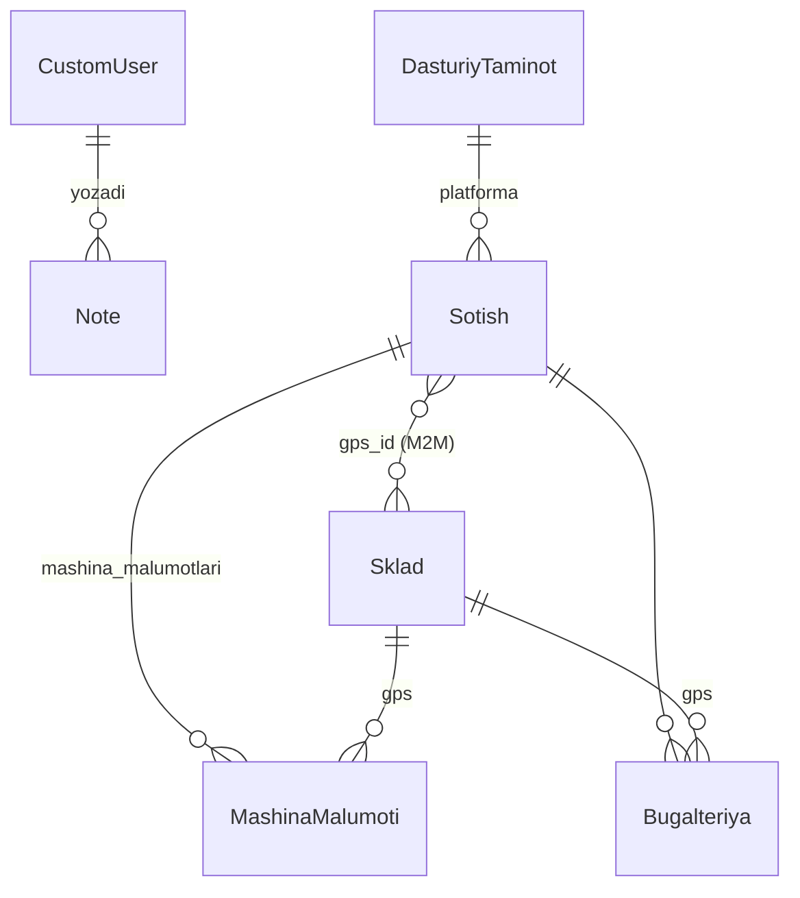
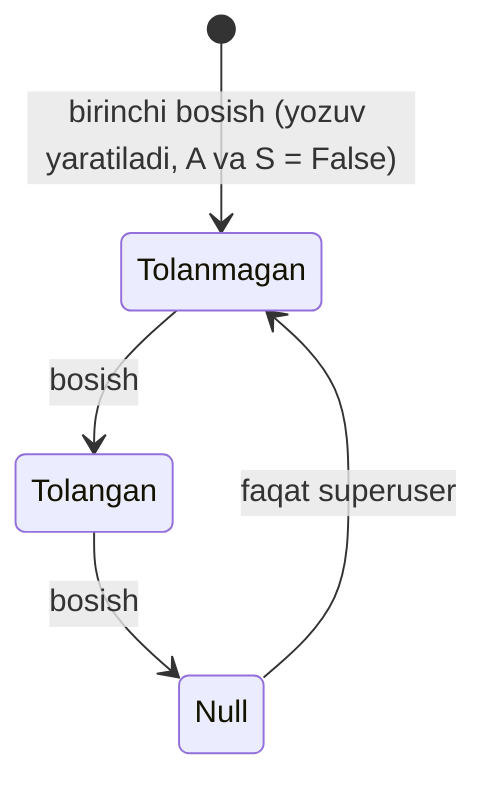

# Arxitektura

Bu hujjatda ma'lumotlar modeli, asosiy biznes qoidalar va sahifalar xaritasi tushuntirilgan.
Kod bilan ishlashdan oldin **"Biznes qoidalar"** bo'limini o'qing — bir nechta maydon nomi
o'z vazifasidan farq qiladi.

## Ma'lumotlar modeli

| Model | Vazifasi | Muhim maydonlar |
|---|---|---|
| `CustomUser` | Tizim foydalanuvchisi (hodim) | `firstname`, `last_name`, `position`, `is_staff` |
| `Sklad` | Bitta GPS qurilma | `gps_id` (IMEI/seriya), `summa_prixod` (kirim narxi), `sotildi_sotilmadi` |
| `DasturiyTaminot` | Kuzatuv platformasi (Wialon va h.k.) | `dasturiy_taminot_nomi` |
| `Sotish` | Mijozga sotuv (bitta mijoz = bitta sotuv) | `mijoz`, `summasi`, `naqd`, `bank_schot`, `karta`, `abonent_tulov`, `gps_id` (M2M) |
| `MashinaMalumoti` | GPS o'rnatilgan mashina | `mashina_turi`, `davlat_raqami` |
| `Bugalteriya` | Bitta GPS'ning bir oylik to'lov holati | `oy`, `yil`, `abonent_tolov`, `sim_karta_tolov` |
| `Rasxod` | Xarajat | `rasxod_nomi`, `sana`, `summa` |
| `Note` | Jamoa eslatmasi | `izoh`, `user`, `sana` |

## Biznes qoidalar

### Nomi aldamchi maydonlar

> [!IMPORTANT]
> - **`Sotish.karta` — bu qarz qoldig'i**, karta orqali to'lov emas. Server uni
>   `summasi − naqd − bank_schot` sifatida hisoblaydi (`SotishFormMixin.save`).
>   Karta/bank orqali to'lov `bank_schot` maydonida saqlanadi.
> - **`Sotish.sim_karta`** — vergul bilan ajratilgan SIM raqamlar ro'yxati. Tartibi
>   `gps_id` bo'yicha tartiblangan GPS'lar tartibiga mos keladi.
> - **`CustomUser.firstname`** — ism shu yerda saqlanadi. `AbstractUser`'dan meros
>   `first_name` ishlatilmaydi. Shablonlarda `{{ user|display_name }}` filtridan foydalaning.

### Sklad holati

- `sotildi_sotilmadi=False` — qurilma skladda, sotuv formasida tanlash mumkin.
- Sotuv saqlanganda tanlangan GPS'lar `True` ga o'tadi. Sotuv tahrirlansa, eski GPS'lar
  bo'shatiladi. Sotuv o'chirilsa, GPS'lar skladga qaytadi.
- Sotilgan GPS'ni skladdan o'chirib bo'lmaydi.
- `gps_id` takrorlanmasligi forma, qo'lda qo'shish va Excel import darajasida tekshiriladi.
  Bazada unique cheklov **yo'q**.

### Sotuv

- Kamida bitta GPS bo'lishi kerak, bitta GPS ikki marta tanlanmaydi.
- To'langan summa (`naqd + bank_schot`) umumiy summadan oshmasligi kerak.
- Hamma yozuvlar bitta `transaction.atomic()` ichida saqlanadi.
- Mijozlar sahifasidagi "Jami" = `summasi + master_summasi + abonent_tulov × GPS soni`.

### Bugalteriya holat mashinasi

Har bir (sotuv, GPS, oy, yil) uchun bitta `Bugalteriya` yozuvi bo'ladi. Bitta yozuv ikkala
katakchani (A va S) boshqaradi.

| UI holati | Qiymat | Belgi |
|---|---|---|
| Belgilanmagan | yozuv yo'q | `+` |
| To'lanmagan | `False` | `✗` |
| To'langan | `True` | `✓` |
| Null | `None` | `−` (oddiy foydalanuvchi uchun qulflangan) |

Endpoint: `POST /update_bugalteriya/` (JSON). Javobdagi `abonent_state` va `sim_state`
qiymatlari `none | unpaid | paid | null` bo'ladi. Frontend holatni o'zi taxmin qilmaydi,
har doim server javobidan chizadi.

### Statistika

Oy bo'yicha ko'rsatkichlar (`StatistikaView`):

- **Qo'shilgan** — shu oyda sotilgan GPS soni.
- **Oldingi oydan** — shu oy boshigacha jami sotilgan GPS soni (oldingi yillar ham kiradi).
- **Jami faol** = Oldingi oydan + Qo'shilgan.
- **To'lov intizomi** = to'langan / (to'langan + to'lanmagan). Belgilanmaganlar hisobga olinmaydi.
- **Abonent tushumi** — to'langan deb belgilangan yozuvlar bo'yicha `Sotish.abonent_tulov` yig'indisi.

## URL xaritasi

| URL | Nomi | Tavsif | Kim |
|---|---|---|---|
| `/` | `login` | Kirish | hamma |
| `/logout/` | `logout` | Chiqish | login |
| `/home/` | `home` | Dashboard | login |
| `/statistika/?year=` | `statistika` | Yillik statistika | login |
| `/sklad/?status=sold\|unsold&export=1` | `sklad-list` | Sklad ro'yxati / Excel | login |
| `/sklad-filter/` | `filter-sklad` | Eski manzil, `sklad-list` bilan bir xil | login |
| `/sklad/add/` | `skladadd` | GPS qabul qilish | login |
| `/sklad/add-excel/` | `gps-add-excel` | POST: import, `?download_template=1`: shablon | login |
| `/sklad/update/<pk>/`, `/sklad/delete/<pk>/` | | Tahrirlash / o'chirish (POST) | superuser |
| `/sotuv/`, `/sotuv/add/`, `/sotuv/update/<pk>/` | | Sotuvlar | login |
| `/sotuv/delete/<pk>/` | `sotish_delete` | O'chirish (POST) | login |
| `/mijozlar/?export=1` | `mijozlar` | Mijozlar / Excel | login |
| `/bugalteriya/?yil=` | `bugalteriya` | To'lovlar jadvali | login |
| `/update_bugalteriya/` | `update_bugalteriya` | To'lov holatini almashtirish (POST JSON) | login |
| `/rasxod/?oy=YYYY-MM`, `/rasxod/add/` | | Rasxodlar | login |
| `/rasxod/update/<pk>/`, `/rasxod/delete/<pk>/` | | Tahrirlash / o'chirish (POST) | superuser |
| `/note/…` | `note-*` | Eslatmalar (faqat muallif tahrirlaydi) | login |
| `/hodimlar/…` | `hodim-*` | Hodimlar | `is_staff` |
| `/admin/` | | Django admin | superuser |

## Views tuzilishi (`IDGPS/views.py`)

- **Mixin'lar:**
  - `StaffRequiredMixin` — `is_staff` talab qiladi, ruxsat bo'lmasa xabar bilan `home` ga yuboradi.
  - `SuperuserRequiredMixin` — `is_superuser` talab qiladi.
- **Yordamchilar:**
  - `parse_money` — `"1 250 000"` → `1250000`.
  - `parse_year` — yilni tekshiradi, noto'g'ri bo'lsa standart qiymat qaytaradi.
  - `month_start` — oy boshini hisoblaydi.
  - `xlsx_response` — sarlavhasi bezatilgan Excel fayl yasab, HTTP javob sifatida qaytaradi.
- **Sotuv:** qo'shish va tahrirlash `SotishFormMixin` orqali umumiy mantiqdan foydalanadi.
  Qatorlar parallel POST ro'yxatlari (`gps_id`, `sim_karta`, `mashina_turi`, `davlat_raqami`)
  sifatida keladi. Xato bo'lsa, forma kiritilgan qatorlar saqlangan holda qayta ko'rsatiladi.
- **N+1 oldini olish:** ro'yxatlarda `select_related`, `prefetch_related` va `annotate(Count(...))`
  ishlatiladi. Statistika har bir oy uchun alohida so'rov yubormaydi, oyma-oy ko'rsatkichlarni
  bir nechta guruhlangan so'rov bilan oladi.

## Formalar (`IDGPS/forms.py`)

- `MoneyField` — probel va vergul bilan yozilgan summani qabul qiladi, input'ga `data-money`
  atributini qo'shadi (yozish davomida formatlash uchun).
- `StyledFormMixin` — widget'larga `input` / `select` / `textarea` klasslarini beradi.
  Validatsiyadan keyin xatoli maydonlarga `is-invalid` qo'shadi.
- `HodimForm` — tahrirlashda parol ixtiyoriy. Bo'sh qolsa, eski xesh saqlanadi.
  `CustomUser.save()` parolni `identify_hasher` yordamida tekshiradi va ochiq matnli bo'lsa xeshlaydi.

## Autentifikatsiya

Sessiyaga asoslangan Django login ishlatiladi. Kirishda qo'shimcha `access_token` JWT cookie
(`HttpOnly`, 1 soat) ham o'rnatiladi. `IDGPS.middleware.JWTAuthenticationMiddleware` faqat
`Authorization: Bearer …` sarlavhasi bo'lgan so'rovlarni tekshiradi — hozircha tashqi API
mijozlari uchun zaxira.
